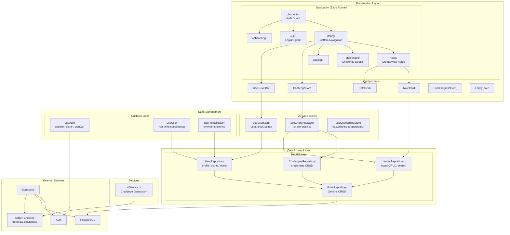
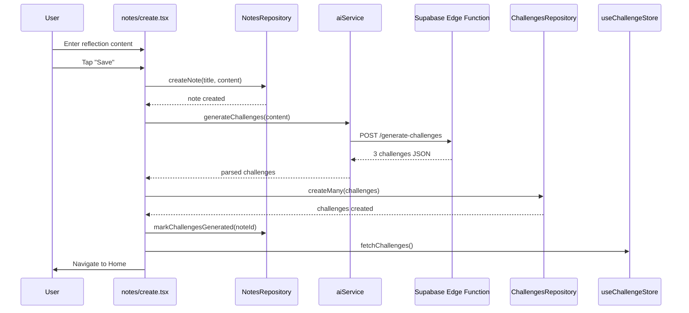
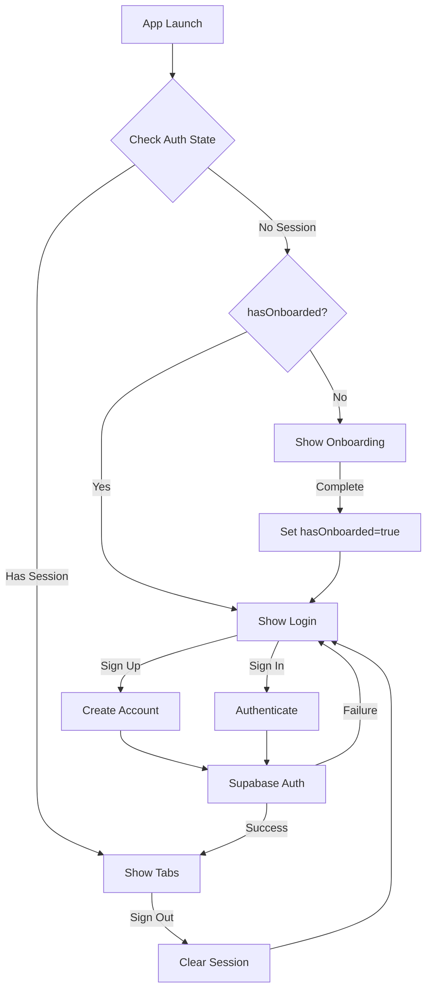
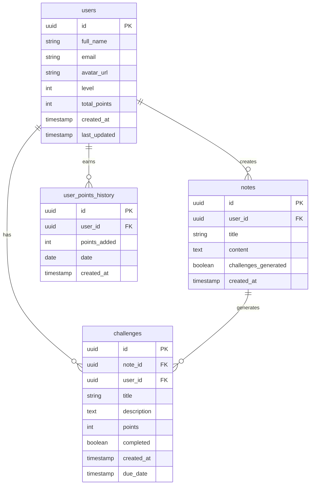

# Improvify

A React Native/Expo app for personal growth through reflective journaling and AI-generated challenges.


# TODOS
### Architecture & State Management Issues

  1. Duplicate User State Management

  You have two separate systems managing user data:
  - useUserStore (Zustand) - used in profile.tsx
  - useUser hook (local useState + real-time subscription) - defined but creates separate state per component

  Problem: They don't share state, causing redundant fetches and potential inconsistencies.

  Fix: Consolidate into one - move the real-time subscription into the Zustand store:
  // Single source of truth with real-time updates built-in
  export const useUserStore = create<State>((set, get) => ({
    // ... state
    subscribeToUpdates: (userId: string) => {
      const subscription = supabase
        .channel(`user-${userId}`)
        .on('postgres_changes', {...}, (payload) => {
          set({ user: payload.new });
        })
        .subscribe();
      return () => subscription.unsubscribe();
    }
  }));

  ---
  2. N+1 Query Problem in Challenge Fetching

  In useChallengeStore.ts:22-29:
  const notes = await notesRepository.findAll();  // 1 query
  const challengesArrays = await Promise.all(
    notes.map((note) => challengesRepository.findByNoteId(note.id))  // N queries!
  );

  Problem: If user has 10 notes, this makes 11 database queries.

  Fix: You already have findByUserId - use it:
  fetchChallenges: async (userId: string) => {
    const challenges = await challengesRepository.findByUserId(userId);  // 1 query
    set({ challenges });
  }

  ---
  3. Auth State Not in Zustand

  useAuth uses useState, so each component instance has its own state copy. While the onAuthStateChange listener syncs them, it's less efficient.

  Fix: Move auth to Zustand for single source of truth:
  export const useAuthStore = create<AuthState>((set) => ({
    session: null,
    userId: null,
    loading: true,
    initialize: () => {
      supabase.auth.onAuthStateChange((_, session) => {
        set({ session, userId: session?.user?.id, loading: false });
      });
    }
  }));

  ---
  4. Missing Data Layer Optimization (React Query)

  Every store manually handles: loading states, error states, caching, refetching.

  Recommendation: Consider https://tanstack.com/query for:
  - Automatic caching & deduplication
  - Background refetching
  - Optimistic updates
  - Stale-while-revalidate pattern

  Example transformation:
  // Before (manual)
  const { challenges, loading, error, fetchChallenges } = useChallengeStore();

  // After (React Query)
  const { data: challenges, isLoading, error } = useQuery({
    queryKey: ['challenges', userId],
    queryFn: () => challengesRepository.findByUserId(userId),
    staleTime: 5 * 60 * 1000, // 5 min cache
  });

  ---
  5. Stale Data on Navigation

  In index.tsx:43-46:
  if (challenges.length === 0) {
    fetchChallenges();
  }
  Problem: Only fetches if empty - doesn't refresh when returning from challenge completion.

  Fix: Always fetch on focus, or use query invalidation:
  useFocusEffect(useCallback(() => {
    fetchChallenges();
  }, [fetchChallenges]));

  ---
  6. Profile Screen Multiple Effects

  profile.tsx has 3 separate useEffect hooks that could be consolidated and has local state for notes that could be in a store.


#### fix eslints 
#### components clean up 
#### Issues I see:

  1. UserLevelBar - Level shown 3x (badge, title, footer stat). Total XP shown 2x (header, footer). Cut the footer stats entirely or show only unique metrics.
  2. NoteCard - The "Reflection" tag is static noise - adds zero information since every note shows it. Remove it.
  3. UserProgressCard - "Keep it up!" is fake motivation with no data backing it. Either connect to real streak data or remove. The footer duplicates info already visible.
  4. ChallengeDetail - "Tips" section is generic filler. The reward preview repeats what's already in the header XP badge.
  5. EmptyState - 3 sparkles + floating animation + glow is excessive. Pick one effect.
  6. NoteDetail - Same "Reflection" badge problem as NoteCard.

  What works:
  - Difficulty color-coding (green/amber/red)
  - Animated progress bar
  - Staggered entrance animations
  - Haptic feedback approach
  - Card depth with colored shadows

  Quick fixes? I can strip out the redundant elements - would clean up the visual noise significantly. Let me know if you want me to slim these down.


#### others
- bro make sure the db is complete and is optimal structure -> this is huge important
- user profile points table? how to do this scalable?
- templates ? better way to do this?
- make it ready to submit to apple - submit and iterate
- make logo 
- think killer features
- streaming of ai response (stream challenges content ?)
- calendar section / row streak
- notion like app -> complete revolutionary ? 

### features?
find cheap llm api -> deepseek?
settings tab + db?
user profile section -> like strava -> reverse engineer them 
long term goals -> task breaker
short term goals

meditation guide, 

cristian mode activated
-> evangelic quotes

do a chatgpt wrapper well rendered

add a fifa diagram on diff aspects of life -> based on points -> also set metadata in the challenge with this diff fields as tags

change quotes to actual suggestions -> about concentration, life, productivity, ... + quotes

make it scalable to make it social (likes + comments (?)) does this make sense? public or private

show animation while thinking
think about toolkit for llm? read tasks, create challenges, idk what else would make sense tbh

what tools do a psicologo have?


⏺ Database Schema Analysis & Scalability Recommendations

  Current Schema Overview

  Your schema supports a note-taking + gamification app with:
  - users: User profiles (gamification with levels/points)
  - notes: User-generated content
  - challenges: Tasks derived from notes
  - user_points_history: Point tracking over time
  - weekly_insights: Analytics/summaries

  ---
  🔴 Critical Issues to Address

  1. Missing Indexes for Common Query Patterns

  -- Add these indexes for better performance:

  -- Compound index for challenges filtered by status
  CREATE INDEX idx_challenges_user_completed ON challenges(user_id, completed);
  CREATE INDEX idx_challenges_user_due_date ON challenges(user_id, due_date) WHERE completed = FALSE;

  -- Notes ordered by date (common query)
  CREATE INDEX idx_notes_user_created ON notes(user_id, created_at DESC);

  -- Points history for date range queries
  CREATE INDEX idx_points_history_user_date ON user_points_history(user_id, date DESC);

  2. Denormalized Counter Problem

  users.total_points is denormalized but lacks a trigger to maintain it. This will cause data inconsistency.

  -- Add trigger to maintain total_points automatically
  CREATE OR REPLACE FUNCTION update_user_total_points()
  RETURNS TRIGGER AS $$
  BEGIN
    IF TG_OP = 'INSERT' THEN
      UPDATE users SET total_points = total_points + NEW.points_added
      WHERE id = NEW.user_id;
    ELSIF TG_OP = 'DELETE' THEN
      UPDATE users SET total_points = total_points - OLD.points_added
      WHERE id = OLD.user_id;
    END IF;
    RETURN NULL;
  END;
  $$ LANGUAGE plpgsql;

  CREATE TRIGGER trg_update_total_points
  AFTER INSERT OR DELETE ON user_points_history
  FOR EACH ROW EXECUTE FUNCTION update_user_total_points();

  3. Level Calculation Not Automated

  The level field should be computed from total_points:

  -- Add function to calculate level from points
  CREATE OR REPLACE FUNCTION calculate_level(points INTEGER)
  RETURNS INTEGER AS $$
  BEGIN
    -- Example: 100 points per level, adjust formula as needed
    RETURN GREATEST(1, FLOOR(points / 100) + 1);
  END;
  $$ LANGUAGE plpgsql IMMUTABLE;

  -- Update trigger to maintain level
  CREATE OR REPLACE FUNCTION update_user_level()
  RETURNS TRIGGER AS $$
  BEGIN
    NEW.level = calculate_level(NEW.total_points);
    RETURN NEW;
  END;
  $$ LANGUAGE plpgsql;

  CREATE TRIGGER trg_update_level
  BEFORE UPDATE OF total_points ON users
  FOR EACH ROW EXECUTE FUNCTION update_user_level();

  ---
  🟡 Schema Improvements for Scalability

  1. Add Challenge Categories/Types

  -- Add challenge_type for better organization and filtering
  CREATE TYPE challenge_type AS ENUM ('review', 'quiz', 'practice', 'reflection', 'custom');

  ALTER TABLE challenges ADD COLUMN type challenge_type DEFAULT 'review';
  CREATE INDEX idx_challenges_type ON challenges(type);

  2. Add Soft Deletes for Data Recovery

  -- Add soft delete capability
  ALTER TABLE notes ADD COLUMN deleted_at TIMESTAMPTZ DEFAULT NULL;
  ALTER TABLE challenges ADD COLUMN deleted_at TIMESTAMPTZ DEFAULT NULL;

  -- Update RLS policies to exclude soft-deleted records
  CREATE POLICY "Users can view own non-deleted notes"
    ON notes FOR SELECT
    USING (auth.uid() = user_id AND deleted_at IS NULL);

  3. Optimize JSONB Columns

  -- Add GIN indexes for JSONB queries
  CREATE INDEX idx_weekly_insights_patterns ON weekly_insights USING GIN (patterns);
  CREATE INDEX idx_weekly_insights_stats ON weekly_insights USING GIN (stats);

  4. Add Updated Timestamps Everywhere

  ALTER TABLE notes ADD COLUMN updated_at TIMESTAMPTZ DEFAULT NOW();
  ALTER TABLE challenges ADD COLUMN updated_at TIMESTAMPTZ DEFAULT NOW();

  -- Trigger for automatic updates
  CREATE TRIGGER notes_updated_at
    BEFORE UPDATE ON notes
    FOR EACH ROW EXECUTE FUNCTION update_last_updated();

  CREATE TRIGGER challenges_updated_at
    BEFORE UPDATE ON challenges
    FOR EACH ROW EXECUTE FUNCTION update_last_updated();

  ---
  🟢 10x Scalability Architecture

  1. Table Partitioning for High-Volume Tables

  For user_points_history (will grow rapidly):

  -- Partition by date range (monthly)
  CREATE TABLE user_points_history_new (
    id UUID DEFAULT gen_random_uuid(),
    user_id UUID NOT NULL,
    points_added INTEGER NOT NULL,
    date DATE NOT NULL DEFAULT CURRENT_DATE,
    created_at TIMESTAMPTZ DEFAULT NOW(),
    PRIMARY KEY (id, date)
  ) PARTITION BY RANGE (date);

  -- Create monthly partitions
  CREATE TABLE user_points_history_2024_01 PARTITION OF user_points_history_new
    FOR VALUES FROM ('2024-01-01') TO ('2024-02-01');
  CREATE TABLE user_points_history_2024_02 PARTITION OF user_points_history_new
    FOR VALUES FROM ('2024-02-01') TO ('2024-03-01');
  -- ... continue for each month

  -- Auto-create partitions via pg_cron or application logic

  2. Materialized Views for Analytics

  -- Daily stats materialized view (refresh periodically)
  CREATE MATERIALIZED VIEW user_daily_stats AS
  SELECT
    user_id,
    date,
    SUM(points_added) as daily_points,
    COUNT(*) as activities_count
  FROM user_points_history
  GROUP BY user_id, date;

  CREATE UNIQUE INDEX idx_user_daily_stats ON user_daily_stats(user_id, date);

  -- Refresh strategy (via pg_cron or Supabase Edge Function)
  -- REFRESH MATERIALIZED VIEW CONCURRENTLY user_daily_stats;

  3. Leaderboard Optimization

  -- Separate leaderboard table (updated hourly/daily)
  CREATE TABLE leaderboard (
    id SERIAL PRIMARY KEY,
    user_id UUID NOT NULL REFERENCES users(id) ON DELETE CASCADE,
    rank INTEGER NOT NULL,
    total_points INTEGER NOT NULL,
    period TEXT NOT NULL, -- 'all_time', 'weekly', 'monthly'
    updated_at TIMESTAMPTZ DEFAULT NOW(),
    UNIQUE(user_id, period)
  );

  CREATE INDEX idx_leaderboard_rank ON leaderboard(period, rank);

  -- Function to refresh leaderboard
  CREATE OR REPLACE FUNCTION refresh_leaderboard(p_period TEXT)
  RETURNS VOID AS $$
  BEGIN
    DELETE FROM leaderboard WHERE period = p_period;

    INSERT INTO leaderboard (user_id, rank, total_points, period)
    SELECT
      id,
      ROW_NUMBER() OVER (ORDER BY total_points DESC),
      total_points,
      p_period
    FROM users
    WHERE total_points > 0;
  END;
  $$ LANGUAGE plpgsql;

  4. Content Search with Full-Text Search

  -- Add full-text search for notes
  ALTER TABLE notes ADD COLUMN search_vector tsvector;

  CREATE OR REPLACE FUNCTION notes_search_vector_update()
  RETURNS TRIGGER AS $$
  BEGIN
    NEW.search_vector =
      setweight(to_tsvector('english', COALESCE(NEW.title, '')), 'A') ||
      setweight(to_tsvector('english', COALESCE(NEW.content, '')), 'B');
    RETURN NEW;
  END;
  $$ LANGUAGE plpgsql;

  CREATE TRIGGER trg_notes_search_vector
  BEFORE INSERT OR UPDATE ON notes
  FOR EACH ROW EXECUTE FUNCTION notes_search_vector_update();

  CREATE INDEX idx_notes_search ON notes USING GIN(search_vector);

  5. Connection Pooling & Read Replicas

  For Supabase at scale:
  - Enable PgBouncer connection pooling (built into Supabase)
  - Use read replicas for analytics queries
  - Configure connection string with ?pgbouncer=true for transaction mode

  ---
  📊 Summary Table

  | Area               | Current State        | Recommended Action                | Impact                        |
  |--------------------|----------------------|-----------------------------------|-------------------------------|
  | Indexes            | Basic indexes only   | Add compound + partial indexes    | 5-10x query speed             |
  | Counters           | Manual, inconsistent | Add triggers for automation       | Data integrity                |
  | Partitioning       | None                 | Partition points_history by month | 10x+ for large tables         |
  | Full-text search   | None                 | Add tsvector column               | Better UX, 100x faster search |
  | Materialized views | None                 | Add for analytics                 | 50x faster dashboard loads    |
  | Soft deletes       | None                 | Add deleted_at columns            | Data recovery                 |
  | Leaderboards       | Query on demand      | Pre-computed table                | 100x faster                   |

  ---
  🚀 Implementation Priority

  1. Immediate (fix data integrity):
    - Add update_user_total_points trigger
    - Add missing compound indexes
  2. Short-term (improve performance):
    - Add full-text search for notes
    - Add updated_at columns
    - Add soft deletes
  3. Growth phase (10x scale):
    - Implement table partitioning
    - Add materialized views for analytics
    - Pre-computed leaderboards
    - Enable connection pooling with read replicas

  Would you like me to generate a complete migration file with all these improvements?

> 📊 Summary Table

  | Area               | Current State        | Recommended Action                | Impact                 
       |
  |--------------------|----------------------|-----------------------------------|------------------------
-------|
  | Indexes            | Basic indexes only   | Add compound + partial indexes    | 5-10x query speed      
       |
  | Counters           | Manual, inconsistent | Add triggers for automation       | Data integrity         
       |
  | Partitioning       | None                 | Partition points_history by month | 10x+ for large tables  
       |
  | Full-text search   | None                 | Add tsvector column               | Better UX, 100x faster 
search |
  | Materialized views | None                 | Add for analytics                 | 50x faster dashboard 
loads    |
  | Soft deletes       | None                 | Add deleted_at columns            | Data recovery          
       |
  | Leaderboards       | Query on demand      | Pre-computed table                | 100x faster            
       |

  ---
  🚀 Implementation Priority

  1. Immediate (fix data integrity):
    - Add update_user_total_points trigger
    - Add missing compound indexes
  2. Short-term (improve performance):
    - Add full-text search for notes
    - Add updated_at columns
    - Add soft deletes

fix those 

⏺ Write(supabase/migrations/20241214000000_schema_improvements.sql)
  ⎿  Wrote 312 lines to supabase/migrations/20241214000000_schema_improvements.sql
     -- ============================================
     -- Schema Improvements Migration
     -- Fixes: Data integrity, Performance, Scalability
     -- ============================================
     -- ============================================
     -- 1. COMPOUND INDEXES FOR COMMON QUERIES
     -- ============================================
     -- Challenges: filter by completion status per user
     … +302 lines (ctrl+o to expand)

⏺ Created migration file at supabase/migrations/20241214000000_schema_improvements.sql. Here's what it includes:

  Summary of Changes

  | Feature            | What It Does                                                              |
  |--------------------|---------------------------------------------------------------------------|
  | Compound Indexes   | 4 new indexes for faster queries on challenges, notes, and points history |
  | Points Trigger     | Auto-updates users.total_points when user_points_history changes          |
  | Level Trigger      | Auto-calculates level from total_points (1 level per 100 points)          |
  | Full-Text Search   | search_vector column + GIN index + search_notes() function                |
  | Updated Timestamps | updated_at columns on notes and challenges with auto-update triggers      |
  | Soft Deletes       | deleted_at columns + updated RLS policies + helper functions              |

  Helper Functions Added

  -- Soft delete/restore
  SELECT soft_delete_note('uuid-here');
  SELECT restore_note('uuid-here');
  SELECT soft_delete_challenge('uuid-here');
  SELECT restore_challenge('uuid-here');

  -- Full-text search
  SELECT * FROM search_notes('your search term');

  To Apply the Migration

  supabase db push
  # or
  supabase migration up

  The migration is idempotent (uses IF NOT EXISTS and DROP IF EXISTS) so it's safe to run multiple times.

> i was thinking ia adding some kind of tag/type of challenge, so i can later do a spider diagram - like 
fifa players. so i can evalueate different aspects of life (finance, sport, social, etc..) do a plan to do 
this to be literally one the most liked features of my app 

⏺ This is a great feature idea - a life balance radar chart like FIFA player cards. Let me plan this properly.
                                                                   
⏺ Entered plan mode
  Claude is now exploring and designing an implementation approach.

⏺ Let me explore the codebase to understand the current architecture and patterns.

⏺ 3 Explore agents finished (ctrl+o to expand)
   ├─ Explore app architecture · 28 tool uses · 43.8k tokens
   │  ⎿  Done
   ├─ Explore challenges implementation · 21 tool uses · 49.1k tokens
   │  ⎿  Done
   └─ Explore charts and UI patterns · 25 tool uses · 48.4k tokens
      ⎿  Done

⏺ Excellent - I now have a complete picture of the codebase. I found some interesting things:

  1. You already have challenge type colors defined in Colors.ts: Mental (purple), Physical (green), Social (orange), Emotional (cyan)
  2. react-native-chart-kit is already installed but doesn't have a built-in radar/spider chart
  3. The AI generates challenges without categories currently

  Let me ask some clarifying questions before designing the plan.
                                                                                                       
⏺ User answered Claude's questions:
  ⎿  · What life categories do you want to track? Here are some popular frameworks: → Wheel of Life (8)
     · Should the AI auto-categorize challenges, or should users pick the category? → AI auto-assigns 
     (Recommended)
     · How should category scores be calculated? → Points earned (Recommended)

⏺ Now let me design a comprehensive plan for this feature.


## Architecture Overview



## Data Flow Diagrams

### Create Note & Generate Challenges



### Authentication Flow



## Directory Structure

```
src/
├── app/                          # Expo Router screens
│   ├── _layout.tsx               # Root layout with auth guard
│   ├── (tabs)/                   # Bottom tab navigation
│   │   ├── _layout.tsx           # Tab bar + FAB
│   │   ├── index.tsx             # Home (challenges list)
│   │   └── profile.tsx           # User profile & notes
│   ├── auth/                     # Authentication screens
│   │   ├── login.tsx
│   │   ├── signup.tsx
│   │   └── forgot-password.tsx
│   ├── notes/                    # Note management
│   │   ├── index.tsx             # Notes list
│   │   ├── create.tsx            # Rich text editor
│   │   ├── [noteId].tsx          # Note detail
│   │   └── templateSelector.tsx  # Template picker
│   ├── challenges/[noteId]/      # Challenge screens
│   │   └── [challengeId].tsx     # Challenge detail
│   ├── onboarding/               # Initial setup
│   └── settings/                 # App settings
│
├── components/                   # Reusable UI components
│   ├── ChallengeCard.tsx         # Challenge display card
│   ├── NoteCard.tsx              # Note preview card
│   ├── NoteDetail.tsx            # Note content view
│   ├── UserLevelBar.tsx          # Progress visualization
│   ├── UserProgressCard.tsx      # Stats card
│   └── EmptyState.tsx            # Empty list placeholder
│
├── hooks/                        # Custom React hooks
│   ├── useAuth.ts                # Auth state & methods
│   ├── useUser.ts                # User with real-time updates
│   └── usePointsHistory.ts       # Points history fetching
│
├── lib/
│   ├── supabase.ts               # Supabase client setup
│   ├── repositories/             # Data access layer
│   │   ├── base.ts               # Generic CRUD operations
│   │   ├── userRepository.ts     # User operations
│   │   ├── notesRepository.ts    # Notes CRUD & search
│   │   └── challengesRepository.ts
│   └── store/                    # Zustand state stores
│       ├── useUserStore.ts       # User state
│       ├── useChallengeStore.ts  # Challenges state
│       └── onboarding.ts         # Onboarding flag
│
├── services/
│   └── aiService.ts              # AI challenge generation
│
├── config/
│   └── env.ts                    # Environment config
│
├── constants/
│   ├── Colors.ts                 # Theme colors
│   └── quotes.ts                 # Motivational quotes
│
├── types/
│   └── index.ts                  # TypeScript definitions
│
└── global.css                    # Global styles
```

## Data Model



## Technology Stack

| Category | Technology |
|----------|------------|
| Framework | React Native + Expo |
| Navigation | Expo Router (file-based) |
| Backend | Supabase (PostgreSQL + Auth) |
| State Management | Zustand |
| Rich Text Editor | react-native-pell-rich-editor |
| Secure Storage | expo-secure-store |
| Styling | React Native StyleSheet + NativeWind |
| Real-time | Supabase Postgres Changes |

## Key Features

- **Reflective Journaling**: Create notes with rich text and templates
- **AI-Generated Challenges**: Automatic challenge generation from reflections
- **Gamification**: Points, levels, and progress tracking
- **Real-time Updates**: Live data sync via Supabase subscriptions
- **Secure Auth**: Email/password authentication with secure token storage

## Getting Started

1. Install dependencies:
   ```bash
   npm install
   ```

2. Set up environment variables:
   ```bash
   cp .env.example .env
   # Add your Supabase credentials
   ```

3. Start the development server:
   ```bash
   npx expo start
   ```
